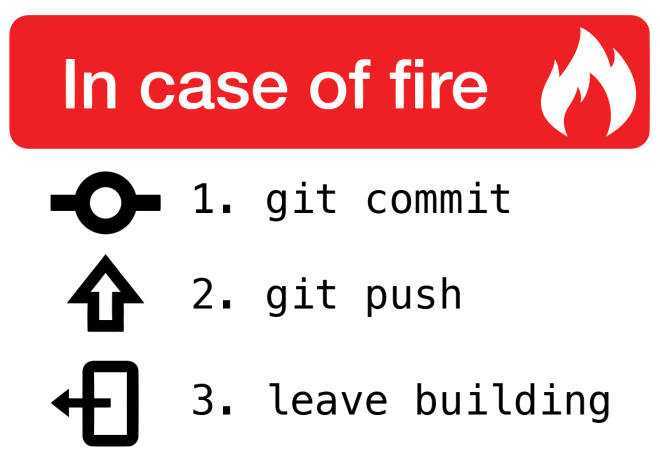

# Boas práticas para commits

## 1. Mensagens claras e concisas

A mensagem de commit deve descrever de forma clara o que foi feito no commit.
Evite mensagens vagas como "Atualizações" ou "Mudanças".

### Exemplo:

>Adiciona função de login com autenticação OAuth

## 2. Tempo verbal no imperativo

As mensagens de commit devem ser escritas no tempo verbal imperativo (como se você estivesse dando uma ordem para o repositório), pois isso descreve claramente a ação realizada no código.

### Exemplo:

> Corrige erro na validação de formulário

## 3. Comece com uma linha resumo curta

A primeira linha da mensagem de commit deve ser uma breve descrição da mudança. Geralmente, recomenda-se que essa linha tenha menos de 50 caracteres.
Use uma linha em branco após o resumo, caso haja uma descrição mais longa. A descrição extra pode ser explicativa, caso o resumo precise de mais detalhes.

### Exemplo:

> Adiciona novo endpoint para recuperação de senha
>
>Agora o sistema permite que o usuário recupere a senha via email.

## 4. Relacione o commit com uma issue ou tarefa

Se o commit resolve uma issue ou está relacionado a uma tarefa, inclua o número da issue ou referência ao sistema de rastreamento de tarefas.

### Exemplo:

> Corrige bug de navegação no mobile (#42)

## 5. Use convenções de nomenclatura de commits

Algumas equipes ou projetos adotam convenções específicas para classificar commits. Por exemplo:

 
- `feat`: Para novos recursos.
- `fix`: Para correções de bugs.
- `docs`: Para mudanças em documentação.
- `style`: Para mudanças relacionadas a estilo (formatação, espaçamento, etc.), sem alterações funcionais.
- `refactor`: Para refatorações de código que não alteram o comportamento.
- `test`: Para adicionar ou corrigir testes.
- `chore`: Para tarefas de manutenção (ex.: atualizações de dependências, tarefas de configuração).

### Exemplo:

> feat: Adiciona funcionalidade de exportação para CSV (#04)

## 6. Evite commits muito grandes

Divida as mudanças em commits menores e mais gerenciáveis. Comitar mudanças em blocos grandes pode dificultar o entendimento do histórico e a resolução de problemas.

## 7. Versione sempre e salve em um repositório seguro

